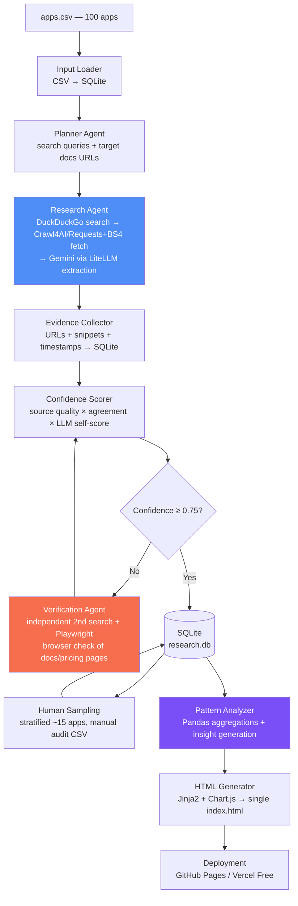
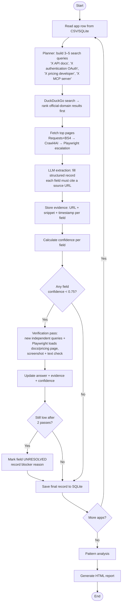
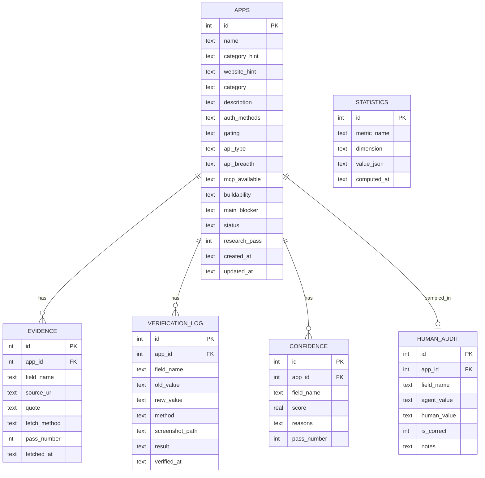
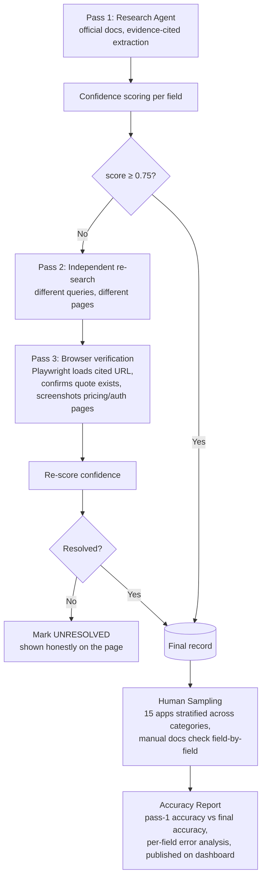
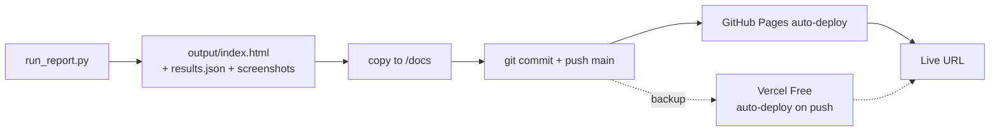
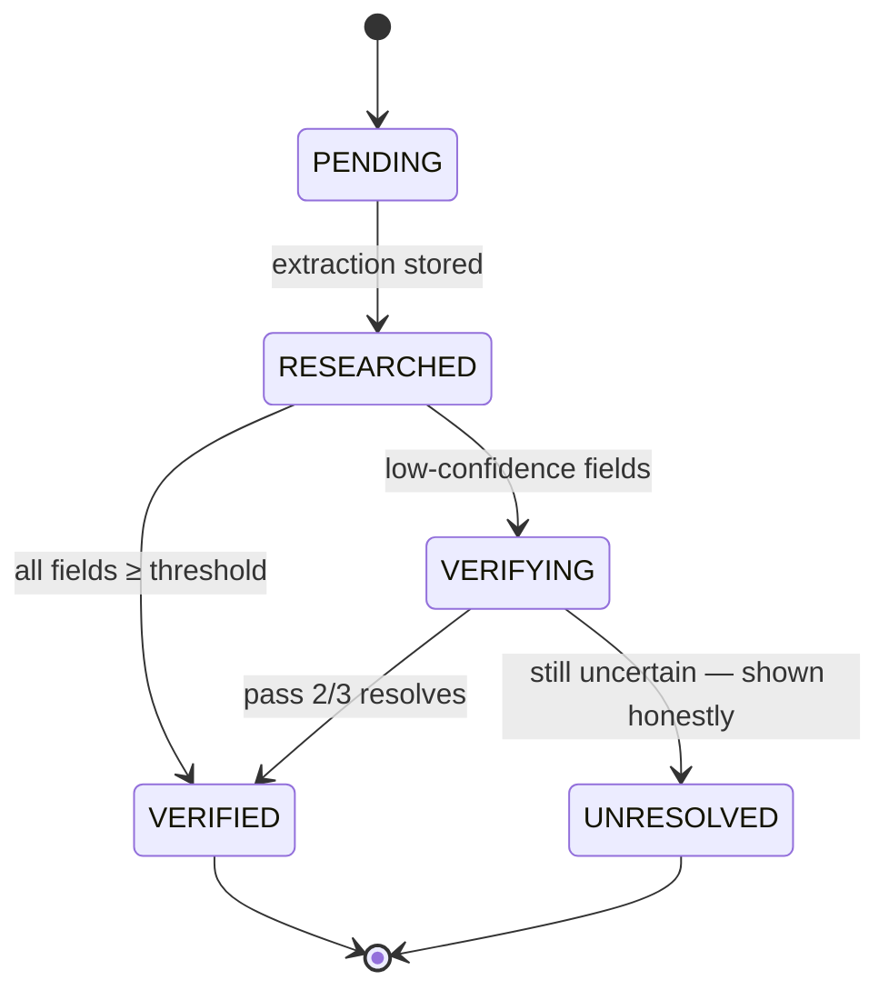

# App Research Agent — Software Design Document

**Project:** Autonomous App Integration Research Pipeline (Composio AI Product Ops Intern Take-Home)
**Author:** Vaibhav Kumar Kanojia
**Status:** Design — pre-implementation
**Budget:** 6–8 hours total effort · $0 spend (free tools only)
**Date:** 2026-07-16

---

## 1. Executive Summary

### Objective

Composio needs to research apps before building toolkits for them: auth method, self-serve availability, API surface, MCP readiness, and buildability. Doing this manually for 100 apps does not scale. This project builds an **AI research agent pipeline** that researches all 100 apps automatically, verifies its own answers through multi-stage loops, extracts cross-app patterns, and publishes a single self-explanatory HTML report.

### What the system builds

1. **A research agent** (LangGraph-style state machine in pure Python) that, per app: searches official docs (DuckDuckGo), scrapes them (Crawl4AI / Requests + BeautifulSoup, Playwright fallback), and extracts a structured record via a free LLM (Gemini Free API through LiteLLM, Ollama as local fallback).
2. **A verification pipeline** that scores confidence per field, re-researches low-confidence answers with a second independent pass (different search queries + browser-based verification via Playwright/Browser Use), and supports a human sampling audit of ~15 apps.
3. **A pattern analyzer** (Pandas + SQLite) that clusters results into the insights that matter: dominant auth, gated categories, common blockers, easy wins vs. outreach-required.
4. **A static HTML dashboard** (Jinja2 + Chart.js via CDN — free) deployed on GitHub Pages / Vercel Free, readable by a reviewer in ~2 minutes with no narration.

### Why the architecture is scalable

- **Data-driven, not app-driven:** apps are rows in a CSV; adding app #101–#1000 requires zero code changes.
- **Idempotent, resumable pipeline:** every stage checkpoints to SQLite; a crash at app 63 resumes at app 63. Rate-limit failures are retried, never fatal.
- **Decoupled stages:** research → verify → analyze → render are independent CLI scripts sharing only the database. Any stage can be re-run, swapped, or parallelized without touching the others.
- **LLM-agnostic:** LiteLLM abstracts the model; Gemini Free today, any provider tomorrow, Ollama offline.
- **Evidence-first:** every claim stores a source URL and a raw text snippet, so answers are auditable forever and verification is cheap.

---

## 2. Functional Requirements

| # | Feature | Description |
|---|---------|-------------|
| FR-1 | **Input Loader** | Read `apps.csv` (100 apps: name, category hint, website hint) into SQLite. |
| FR-2 | **Planner Agent** | For each app, generate a research plan: search queries, likely docs URLs, fields to fill. |
| FR-3 | **Research Agent** | Execute searches (DuckDuckGo), fetch pages, extract per-app record: category, one-liner, auth method(s), self-serve vs gated, API type/breadth, MCP availability, buildability verdict, main blocker. |
| FR-4 | **Evidence Collector** | Store every source URL + raw text snippet + fetch timestamp per field, linked to the app. |
| FR-5 | **Confidence Scorer** | Score each field 0–1 from source quality, cross-source agreement, and LLM self-report. |
| FR-6 | **Verification Agent** | Second-pass re-research of low-confidence fields with independent queries; Playwright/Browser Use to load docs pages and confirm claims (e.g., pricing page shows "Contact Sales"). |
| FR-7 | **Human Sampling Module** | Export a random stratified sample (~15 apps) as a checklist; ingest human verdicts; compute accuracy before/after verification. |
| FR-8 | **Pattern Analyzer** | Compute aggregate insights: auth distribution, gating by category, common blockers, MCP coverage, easy wins vs hard integrations. |
| FR-9 | **HTML Generator** | Jinja2 renders one static, self-contained dashboard page: hero, metrics, charts, insights, interactive table, verification report, methodology. |
| FR-10 | **Charts** | Chart.js visualizations (pie, bar, stacked bar, heatmap-style matrix) embedded with inline data — no backend. |
| FR-11 | **Deployment** | One-command publish to GitHub Pages (primary) or Vercel Free (backup). |
| FR-12 | **Reproducibility CLI** | `python scripts/run_all.py` reproduces the entire pipeline from `apps.csv` with only free API keys in `.env`. |
| FR-13 | **Failure Honesty** | Apps the agent could not resolve are flagged `UNRESOLVED` and shown on the page, not hidden. |

---

## 3. Non-Functional Requirements

| Category | Requirement | Target |
|----------|-------------|--------|
| **Accuracy** | Field-level accuracy on the human-audited sample after verification | ≥ 90% (report first-pass vs final honestly, e.g. 78% → 92%) |
| **Speed** | Full 100-app run within free-tier rate limits | ≤ 90 min end-to-end (Gemini free: ~10–15 RPM budgeted with backoff) |
| **Scalability** | Add apps without code change; stages parallelizable | O(n) in apps, checkpoint per app |
| **Reliability** | No single fetch/LLM failure kills the run | Retry w/ exponential backoff; per-app try/except; resume from SQLite |
| **Maintainability** | Prompts, schemas, config isolated from logic | Prompts in `/prompts/*.md`, schemas in `models/`, config in `config.yaml` |
| **Reproducibility** | Anyone reruns with free keys only | Pinned `requirements.txt`, seeded sampling, `.env.example`, README runbook |
| **Cost** | Total spend | $0 — Gemini Free API, DuckDuckGo, GitHub Pages |
| **Honesty** | Unverifiable claims never presented as facts | Confidence shown per row; `UNKNOWN`/`UNRESOLVED` are first-class values |

---

## 4. Complete System Architecture



**Key design decisions**

| Decision | Choice | Rationale |
|----------|--------|-----------|
| Orchestration | Pure-Python state machine (LangGraph-style nodes) | Zero framework lock-in, trivially debuggable in 6–8 hr budget; LangGraph optional drop-in |
| LLM | Gemini 2.x Flash Free via LiteLLM | Free tier is generous; LiteLLM makes it swappable; Ollama offline fallback |
| Search | DuckDuckGo (`ddgs` library) | Free, no API key, no quota |
| Scraping | Requests+BS4 first, Crawl4AI for JS-light pages, Playwright only when needed | Cheapest tool that works, escalate on failure |
| Storage | SQLite | Zero setup, transactional checkpoints, queryable with Pandas |
| Report | Static HTML, single file | Assignment requires "one self-explanatory HTML page"; no server = free hosting |

---

## 5. Complete Agent Workflow (per app)



---

## 6. Folder Structure

```
composio-research-agent/
├── README.md
├── requirements.txt
├── .env.example                  # GEMINI_API_KEY= (free), optional FIRECRAWL_API_KEY=
├── config.yaml                   # rate limits, thresholds, model name, sample size
├── data/
│   ├── apps.csv                  # the 100-app input list
│   └── research.db               # SQLite (generated)
├── agents/
│   ├── __init__.py
│   ├── planner.py                # query planning per app
│   ├── researcher.py             # search + fetch + extract loop
│   ├── verifier.py               # second-pass + browser verification
│   ├── pattern_analyzer.py       # insight generation
│   └── graph.py                  # pipeline state machine wiring
├── prompts/
│   ├── extraction.md             # structured-record extraction prompt
│   ├── verification.md           # adversarial re-check prompt
│   ├── planning.md               # query-planning prompt
│   └── insight.md                # pattern narration prompt
├── models/
│   ├── schemas.py                # dataclasses / pydantic: AppRecord, Evidence, Verdict
│   └── enums.py                  # AuthMethod, ApiType, Gating, Buildability
├── tools/
│   ├── search.py                 # DuckDuckGo wrapper w/ official-domain ranking
│   ├── fetcher.py                # Requests→Crawl4AI→Playwright escalation ladder
│   ├── llm.py                    # LiteLLM client, retry, rate limiting, JSON parsing
│   └── browser.py                # Playwright verification actions + screenshots
├── verification/
│   ├── confidence.py             # scoring formula
│   ├── sampler.py                # stratified human-audit sample export/import
│   └── accuracy.py               # first-pass vs final accuracy computation
├── storage/
│   ├── db.py                     # SQLite schema + CRUD + checkpoint/resume
│   └── export.py                 # DB → JSON for the dashboard
├── templates/
│   ├── index.html.j2             # dashboard template
│   └── partials/                 # hero, charts, table, verification sections
├── output/
│   ├── index.html                # generated deliverable
│   ├── results.json              # full dataset (agent-consumable)
│   └── screenshots/              # Playwright verification evidence
├── scripts/
│   ├── run_all.py                # full pipeline, resumable
│   ├── run_research.py           # stage 1 only
│   ├── run_verification.py       # stage 2 only
│   ├── run_report.py             # stages 3–4 only
│   └── export_sample.py          # human-audit checklist
└── docs/
    └── DESIGN.md                 # this document
```

---

## 7. Module Explanations

| Module | Purpose | Input | Output | Dependencies |
|--------|---------|-------|--------|--------------|
| `data/` | Source of truth input + generated DB | `apps.csv` | `research.db` | — |
| `agents/planner.py` | Turn an app row into targeted search queries and candidate docs domains | App row | `ResearchPlan` (queries, priority domains) | `tools/llm.py`, `prompts/planning.md` |
| `agents/researcher.py` | Core loop: search → fetch → extract → store | `ResearchPlan` | Draft `AppRecord` + `Evidence[]` | `tools/*`, `storage/db.py` |
| `agents/verifier.py` | Re-research low-confidence fields independently; drive browser checks | Draft record + confidence | Updated record, verification log | `tools/browser.py`, `verification/confidence.py` |
| `agents/pattern_analyzer.py` | Aggregate 100 records into insights | Final records (Pandas frame) | `insights.json` (stats + narrated findings) | Pandas, `tools/llm.py` |
| `agents/graph.py` | Wire stages into a resumable state machine | config + DB state | Orchestrated run | all agents |
| `prompts/` | All LLM instructions, versioned as files | — | Prompt strings | — |
| `models/` | Typed schemas and enums; single source of field definitions | — | Dataclasses | pydantic (or dataclasses) |
| `tools/search.py` | DuckDuckGo queries; boost official domains; dedupe | Query strings | Ranked URL list | `ddgs` |
| `tools/fetcher.py` | Escalation ladder: Requests+BS4 → Crawl4AI → Playwright; polite delays | URL | Clean text/markdown | requests, bs4, crawl4ai, playwright |
| `tools/llm.py` | LiteLLM calls with JSON-mode parsing, retry, RPM throttle | Prompt + context | Parsed JSON | litellm |
| `tools/browser.py` | Playwright: load page, extract selectors, screenshot for evidence | URL + check spec | Pass/fail + screenshot path | playwright |
| `verification/` | Confidence math, sampling, accuracy report | Records + human CSV | Scores, accuracy metrics | pandas |
| `storage/` | Schema, CRUD, checkpointing, JSON export | Records | DB rows / `results.json` | sqlite3 |
| `templates/` | Jinja2 dashboard | `results.json` + `insights.json` | — | jinja2 |
| `output/` | Final deliverables (committed / deployed) | — | `index.html`, JSON, screenshots | — |
| `scripts/` | CLI entrypoints per stage | argv + config | Stage execution | everything above |

---

## 8. Data Flow

1. **Ingest** — `apps.csv` → `apps` table. Each app gets status `PENDING`.
2. **Plan** — Planner writes 3–5 queries per app (deterministic templates + optional LLM refinement). Stored so runs are reproducible.
3. **Search** — DuckDuckGo returns URLs; official-domain results (matching the website hint) are ranked first. Top 3–5 URLs selected.
4. **Fetch** — Each URL passes through the escalation ladder; extracted text is truncated to a token budget and cached on disk (re-runs never re-fetch).
5. **Extract** — One LLM call per app receives all page texts and the JSON schema; returns the structured record, with a `source_url` and `quote` per field. Fields the sources don't support must be returned as `UNKNOWN` (prompt-enforced).
6. **Evidence** — Every field's URL + quote + timestamp lands in the `evidence` table.
7. **Score** — Confidence computed per field (see §11). App status → `RESEARCHED`.
8. **Verify** — Fields < 0.75 trigger the Verification Agent: fresh queries phrased differently, plus Playwright loading the cited page to confirm the quote actually exists there. Updated values overwrite with `pass=2` provenance. Status → `VERIFIED` or `UNRESOLVED`.
9. **Human audit** — Stratified sample exported to CSV; human verdicts imported; accuracy stats computed for both pass 1 and pass 2 answers.
10. **Analyze** — Pandas reads final records → aggregate stats → LLM narrates top insights (numbers computed in code, never by the LLM).
11. **Render** — `results.json` + `insights.json` injected into Jinja2 → single `output/index.html` with inline data.
12. **Deploy** — `output/` pushed to `gh-pages` branch (or Vercel).

---

## 9. Database Design (SQLite)



**Table notes**

- `apps.status` ∈ {`PENDING`, `RESEARCHED`, `VERIFIED`, `UNRESOLVED`} — drives resumability.
- `apps.auth_methods` is a JSON array string (apps often support OAuth2 **and** API key).
- Enumerated values (from `models/enums.py`): `gating` ∈ {SELF_SERVE, FREE_WITH_APPROVAL, PAID_ONLY, PARTNER_GATED, UNKNOWN}; `api_type` ∈ {REST, GRAPHQL, BOTH, SDK_ONLY, NONE, UNKNOWN}; `buildability` ∈ {BUILD_NOW, BUILD_WITH_CAVEATS, BLOCKED, UNKNOWN}.
- `STATISTICS` caches Pattern Analyzer outputs so the HTML generator never recomputes.

---

## 10. Agent Design

### Planner Agent
- **Does:** converts `(name, category_hint, website_hint)` into a research plan: search queries per field group, expected official domains, and a docs-URL guess (e.g., `developers.{domain}`).
- **Why separate:** query quality decides research quality; keeping it isolated lets us tune queries without touching the researcher.
- **LLM usage:** minimal — mostly deterministic templates, LLM only to disambiguate odd apps (e.g., "Twenty" the CRM vs the word).

### Research Agent
- **Does:** the search → fetch → extract loop. One structured extraction call per app over the concatenated docs text. Enforces: every field cites a URL + quote; unsupported fields = `UNKNOWN`; never invent URLs.
- **Failure handling:** per-app try/except; fetch escalation ladder; rate-limit backoff; app marked `UNRESOLVED` only after all fallbacks fail.

### Verification Agent
- **Does:** adversarial second pass on low-confidence fields. Independent queries (different phrasing, e.g., "does X have a free developer plan" instead of "X API pricing"). Playwright loads the cited evidence URL and confirms the quote text is actually present (guards against hallucinated citations); screenshots saved as proof. For gating questions, loads the pricing/signup page directly.
- **Key property:** it does not see the first pass's reasoning — only the field and the claim — so it can't confirmation-bias itself.

### Pattern Agent
- **Does:** all aggregate statistics **in Pandas** (counts, percentages, cross-tabs by category). The LLM only narrates pre-computed numbers into insight sentences — it never computes, so insights can't be numerically hallucinated.
- **Outputs:** headline insights (auth dominance, gating hotspots, top blockers, easy-win list, outreach-required list) + all chart datasets.

### HTML Agent (Generator)
- **Does:** deterministic Jinja2 render — no LLM in the render path, so output is stable and reproducible. Injects `results.json` inline (page works offline, and is machine-readable: an agent can parse the embedded JSON directly).

---

## 11. Verification Strategy

The core of the assignment. Multi-stage pipeline:



### Confidence formula

Per field: `confidence = 0.4·S + 0.35·A + 0.25·L`

| Component | Meaning | Scoring |
|-----------|---------|---------|
| **S — Source quality** | Where the evidence came from | official docs domain = 1.0 · official blog/help center = 0.8 · reputable third party (GitHub, MCP registries) = 0.6 · forum/blog = 0.3 · no source = 0.0 |
| **A — Agreement** | Do independent sources agree? | 2+ sources agree = 1.0 · single source = 0.6 · sources conflict = 0.2 |
| **L — LLM self-score** | Extraction model's stated certainty (calibrated: "explicitly stated in text" vs "inferred") | explicit quote = 1.0 · inferred = 0.5 · guessed = 0.0 |

Thresholds: **≥ 0.75** accept · **0.4–0.75** verify (pass 2/3) · **< 0.4 after verification** → `UNRESOLVED`.

Additional hard rules (override the formula):
- A field with **no evidence URL** can never exceed 0.4.
- Browser verification failing to find the quote on the cited page **zeroes** that evidence and forces re-research (hallucinated-citation guard).
- Gating claims (`PAID_ONLY`, `PARTNER_GATED`) require pricing/signup-page evidence specifically, not blog mentions.

### Human sampling protocol

- Stratified random sample: **15 apps** (at least 1 per category, seeded RNG for reproducibility), ~9 fields each ≈ 135 field checks.
- Auditor (me) checks each field against real docs by hand, fills `human_audit` CSV.
- Report computes: **first-pass accuracy**, **post-verification accuracy**, per-field error rates (e.g., "gating was the hardest field: 73% → 89%"), and a confusion list of every miss — published verbatim on the dashboard. Misses are the credibility feature, not a flaw.

---

## 12. Pattern Detection

All numbers computed in Pandas from final records; LLM narrates only.

| Insight | Computation |
|---------|-------------|
| **Auth distribution** | % of apps supporting OAuth2 / API key / Basic / token (multi-label counts) |
| **REST vs GraphQL** | `api_type` distribution overall and per category |
| **Gating by category** | Cross-tab `category × gating` → which categories are self-serve vs contact-sales (hypothesis: CRM/Finance gated, Dev-tools self-serve) |
| **Most common blockers** | Frequency count of normalized `main_blocker` values (partner approval, paid-only, no public API, OAuth app review, etc.) |
| **MCP coverage** | % with official MCP / community MCP / none, by category |
| **Easy wins** | `buildability=BUILD_NOW ∧ gating=SELF_SERVE ∧ api_type∈{REST,GRAPHQL}` — the "build this week" list |
| **Hard integrations** | `PARTNER_GATED ∨ BLOCKED` — the "needs outreach" list with the specific gate named |
| **Auth × gating correlation** | Do OAuth2-only apps gate more than API-key apps? |
| **Verification delta** | Which fields/categories the agent got wrong most (meta-insight about the method itself) |

The dashboard leads with the 4–5 strongest of these as headline statements ("X% of the 100 apps are buildable today; the single biggest blocker is Y, concentrated in category Z").

---

## 13. HTML Dashboard Design

Single static page, self-contained, dark-professional theme, skimmable in 2 minutes top-to-bottom:

| Section | Content |
|---------|---------|
| **1. Hero** | Title, one-sentence framing, run metadata (date, model, total cost: $0), links to repo + methodology |
| **2. Key Metrics strip** | Big-number tiles: 100 apps · X% buildable today · Y% self-serve · Z% with MCP · final accuracy % (with first-pass % struck through beside it) |
| **3. Headline Insights** | The patterns, stated plainly in 4–5 bolded sentences with supporting mini-stats — this is "the point", placed above the table |
| **4. Charts grid** | §14 visualizations, 2-column responsive grid |
| **5. Easy Wins / Needs Outreach** | Two side-by-side lists with blocker badges |
| **6. Interactive Table** | All 100 apps: sortable, text-filterable, category filter chips; columns = every researched field + confidence badge (green/amber/red) + evidence link; `UNRESOLVED` rows visibly flagged. Vanilla JS, data inlined as JSON |
| **7. The Agent** | Compact Mermaid workflow diagram + short "what it does / where a human was needed" text |
| **8. Verification** | Accuracy before → after, sample size, per-field error table, honest miss list with what went wrong |
| **9. Footer** | Repo link, reproduce instructions (3 commands), limitations, author |

Machine-readability: full dataset embedded as `<script type="application/json" id="dataset">` so an agent can consume the page too (explicit assignment requirement).

---

## 14. Charts (Chart.js, inline data)

| # | Chart | Type | Shows |
|---|-------|------|-------|
| 1 | Auth methods | **Doughnut/Pie** | OAuth2 vs API key vs Basic vs token vs other |
| 2 | Buildability verdicts | **Pie** | Build now / with caveats / blocked / unresolved |
| 3 | Gating by category | **Stacked horizontal bar** | 10 categories × gating levels — the money chart |
| 4 | API type by category | **Stacked bar** | REST / GraphQL / both / none per category |
| 5 | Top blockers | **Horizontal bar** | Blocker frequency, sorted |
| 6 | MCP availability | **Grouped bar** | Official / community / none, per category |
| 7 | Category × auth matrix | **Heatmap** (CSS grid of colored cells — no plugin needed) | Which auth patterns cluster where |
| 8 | Confidence distribution | **Histogram (bar)** | Score spread, pass 1 vs final overlaid — visualizes the verification lift |
| 9 | Research treemap (stretch) | **Treemap** (CSS flex tiles sized by count) | Apps sized by category, colored by buildability |
| 10 | Pipeline timeline (stretch) | **Horizontal timeline bar** | Wall-clock per stage of the actual run |

Charts 1–8 are committed scope; 9–10 only if time remains.

---

## 15. Deployment Plan

**Primary: GitHub Pages**
1. Repo `composio-research-agent` (public).
2. `output/` contents (`index.html`, `results.json`, `screenshots/`) copied to `/docs` on `main` (or `gh-pages` branch).
3. Settings → Pages → deploy from `/docs`. Live at `https://vaibhav410.github.io/composio-research-agent/`.
4. Zero build step — the page is fully static; redeploy = re-run `run_report.py` + push.

**Backup: Vercel Free** — import repo, output dir `output/`, framework "Other". Useful if custom headers or instant preview URLs are needed.

Both are free, HTTPS, and require no server — consistent with the static single-file deliverable.

---

## 16. README Outline

```
# Composio App Research Agent
> AI agent that researched 100 apps for toolkit buildability — with verification loops. Live report: <link>

1. TL;DR              — what it found (3 headline insights), accuracy achieved, cost ($0)
2. Live Demo          — dashboard link + screenshot
3. What the Agent Does — pipeline diagram, stage summary, where a human was needed
4. Quickstart         — clone → pip install -r requirements.txt → playwright install →
                        cp .env.example .env (add free Gemini key) → python scripts/run_all.py
5. Pipeline Stages    — run_research / run_verification / run_report, each resumable
6. Verification & Accuracy — methodology, sample size, first-pass vs final numbers, miss list
7. Project Structure  — annotated tree
8. Configuration      — config.yaml keys (model, thresholds, rate limits, sample seed)
9. Design Decisions & Trade-offs — why pure Python, why SQLite, why static HTML
10. Limitations & Honest Failures — unresolved apps and why
11. Cost & Reproducibility — free-tier notes, expected runtime
12. License
```

---

## 17. Risks & Mitigations

| Risk | Impact | Mitigation |
|------|--------|------------|
| **LLM hallucinations** (invented auth methods, fake MCP claims) | Wrong data undermines the whole deliverable | Evidence-required extraction (URL + quote per field); browser check that the quote exists on the cited page; `UNKNOWN` is a legal answer; verification pass is blind to pass-1 reasoning |
| **Wrong/outdated documentation** | Correct extraction of incorrect facts | Prefer official domains; multi-source agreement in confidence score; fetch timestamps recorded; conflicts lower confidence and trigger verification |
| **Broken links / 404s** | Missing evidence | Fetch escalation ladder; DuckDuckGo re-search on 404; dead evidence link zeroes that evidence, forces re-research |
| **API/docs changes after run** | Report drifts from reality | Timestamps on every claim + "researched on <date>" banner; rerun is one command |
| **Gemini free-tier rate limits** | Run stalls or dies | Client-side RPM throttle, exponential backoff, per-app checkpointing (resume, never restart), Ollama local fallback model |
| **DuckDuckGo throttling / CAPTCHA** | Search failures | Polite delays + retries; fallback to direct docs-URL guessing from website hint (`developers.X.com`, `docs.X.com`); optional Firecrawl free-quota search |
| **JS-heavy docs sites** (Stoplight, ReadMe portals) | Empty scrapes | Escalation to Crawl4AI then Playwright rendering |
| **Missing/ambiguous MCP info** | MCP field unreliable | Targeted queries against known registries (official vendor docs, `github.com/modelcontextprotocol/servers`, mcp directories); "no MCP found (searched X, Y)" recorded as the finding with evidence |
| **Ambiguous app identity** (e.g., "Twenty", "Plain", "fanbasis") | Researching the wrong product | Planner pins the official domain from the CSV hint; all pages must match that domain family |
| **Time overrun** (6–8 hr budget) | Incomplete submission | Phased roadmap (§18) where every phase ends in a submittable state; charts 9–10 and Browser-Use extras are explicitly stretch |

---

## 18. Development Roadmap

| Phase | Goal | Files created | Expected output | Time |
|-------|------|---------------|-----------------|------|
| **1 — Skeleton & data layer** | Repo, schemas, DB, input loading, config | `models/`, `storage/db.py`, `data/apps.csv`, `config.yaml`, `scripts/run_all.py` (stub) | `research.db` with 100 `PENDING` apps; pipeline scaffolding runs end-to-end with mocks | ~1 hr |
| **2 — Research Agent** | Working search→fetch→extract loop on 10 apps, then all 100 | `agents/planner.py`, `agents/researcher.py`, `tools/search.py`, `tools/fetcher.py`, `tools/llm.py`, `prompts/extraction.md` | 100 draft records with evidence rows; unresolved list | ~2 hr |
| **3 — Verification** | Confidence scoring, second pass, Playwright checks, human sample | `verification/`, `agents/verifier.py`, `tools/browser.py`, `prompts/verification.md`, `scripts/export_sample.py` | Verified records, screenshots, human-audit CSV filled, accuracy numbers (pass 1 vs final) | ~1.5–2 hr |
| **4 — Patterns & dashboard** | Aggregations + full HTML report | `agents/pattern_analyzer.py`, `templates/`, `storage/export.py`, `scripts/run_report.py` | `output/index.html` with all sections and charts 1–8 | ~1.5–2 hr |
| **5 — Deploy & polish** | Ship it | README, `.env.example`, Pages/Vercel setup | Live URL + public repo + final checklist pass | ~0.5–1 hr |

Fail-safe: if Phase 3 runs long, ship with a smaller human sample (8 apps) rather than skipping verification — accuracy reporting is the assignment's stated top priority.

---

## 19. Flowcharts

**System Architecture** — see §4.
**Agent Workflow** — see §5.
**Verification Pipeline** — see §11.

### Deployment Pipeline



### Pipeline State Machine (per app, resumability view)



---

## 20. Final Pre-Submission Checklist

**Pipeline**
- [ ] `python scripts/run_all.py` completes from a clean clone with only a free Gemini key
- [ ] All 100 apps have status `VERIFIED` or `UNRESOLVED` (none stuck `PENDING`)
- [ ] Every non-UNKNOWN field has ≥1 evidence URL; spot-check 5 random evidence links open and support the claim
- [ ] Rerun of a single stage is idempotent (no duplicate rows)

**Verification & honesty**
- [ ] Human sample audited (≥15 apps), `human_audit` imported
- [ ] Dashboard shows first-pass accuracy vs final accuracy with the miss list
- [ ] `UNRESOLVED` apps visible on the page with the reason
- [ ] No number on the page comes from an LLM — all stats traced to Pandas code

**Dashboard**
- [ ] Understandable in 2 minutes with no narration (test on a friend)
- [ ] Headline insights above the table
- [ ] Table sorts/filters; confidence badges render; evidence links work
- [ ] Charts 1–8 render with real data; page works offline (single file, inline data)
- [ ] Embedded JSON dataset parses (agent-consumable)
- [ ] Mobile-reasonable, no horizontal page scroll

**Delivery**
- [ ] Live URL loads (incognito test)
- [ ] Repo public; README quickstart verified on a fresh machine/venv
- [ ] `.env.example` present; no real keys committed; `requirements.txt` pinned
- [ ] Page states run date, model used, total cost ($0), and limitations
- [ ] I can explain every design decision in this doc for the interview

---

*End of design document. Implementation begins at Phase 1 upon approval.*
